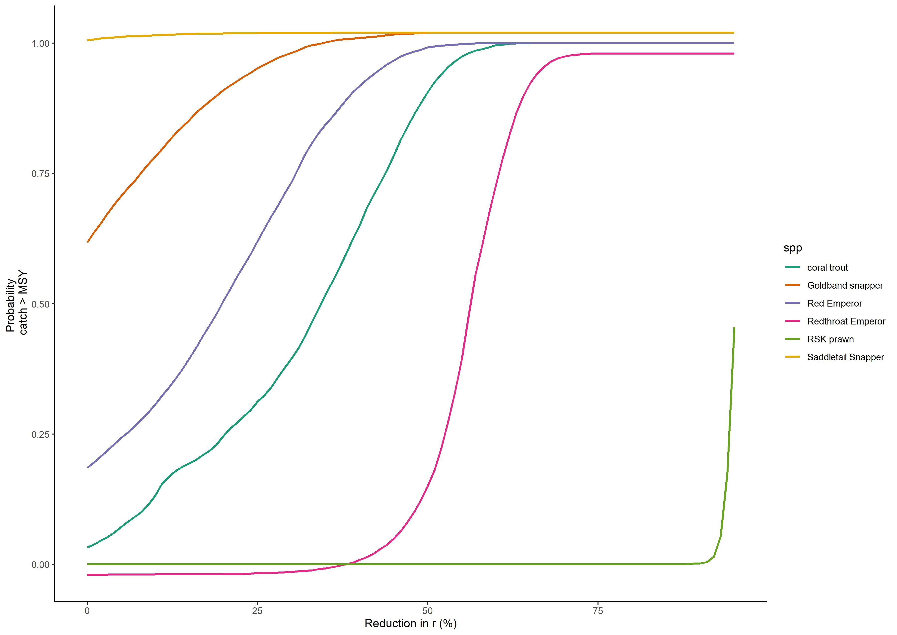

# Surplus production model for quantifying risk of overfishing under habitat change 

Citation: [Brown, C.J., Taylor, W., Wabnitz, C.C.C. et al. Dependency of Queensland and the Great Barrier Reef’s tropical fisheries on reef-associated fish. Sci Rep 10, 17801 (2020). https://doi.org/10.1038/s41598-020-74652-2](https://www.nature.com/articles/s41598-020-74652-2)

Open-access

Code from the paper, specifically the code for figure 5. Uses stan to fit a Pella-Tomlinson surplus production model to CPUE series. Then estimates the probability of overfishing, given a sudden productivity decline (ostensibly caused by coral habitat loss, as per processes described in [Brown et al. 2019](https://onlinelibrary.wiley.com/doi/abs/10.1111/faf.12318))

The stan code is optimized for computational efficiency. See notes therein. The optimization does make interpreting the model a bit more difficult, but it speeds up the MCMC chains considerably. 

**Figure 5** Probability present day catch exceeds estimated MSY reference point given different assumed % reductions in the intrinsic growth rate (r).

## Files and folders

### data-raw

Spreadsheets from [Qfish](https://qfish.fisheries.qld.gov.au/) with the fish data in them

### create-data.R  

Creates dataframes to input to the next script that does model fitting

### surplus-prodn-risk-analysis.R

Loops over all species to fit the models, then calculates risk of overfishing. 

### surplus-prodn-model-cpue.stan 

The model fitting in stan!

### SP-tables.Rmd

Handy Rmd script that creates supplemental tables of model parameter estimates. 
